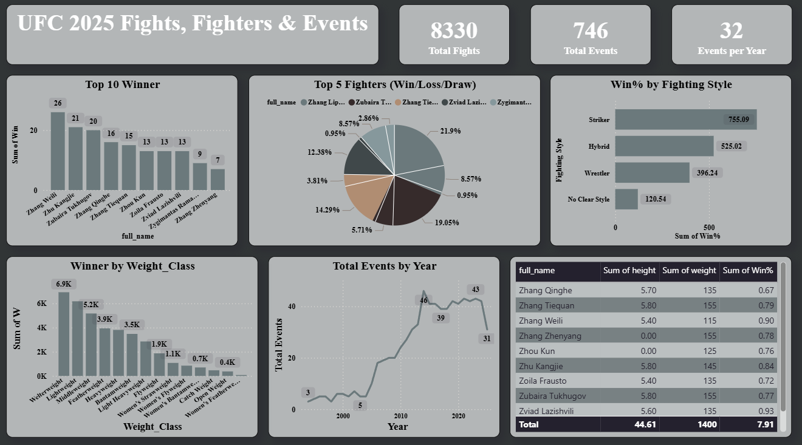

# 🥊 UFC 2025 Fights, Fighters & Events Dashboard



## 📊 Project Overview

This Power BI dashboard provides a comprehensive overview of **UFC 2025 fights, fighters, and events**. It highlights fight statistics, 
fighter performance, and trends across multiple categories like fighting style, weight class, and event frequency.

The goal of this project is to visualize data-driven insights for better understanding of fighter dominance, winning trends, and the evolution of UFC events over time.

---

## ⚙️ Tools & Technologies

* **Power BI** – Data modeling, DAX calculations, and visualization
* **Microsoft Excel / SQL Server** – Data cleaning and preprocessing
* **DAX (Data Analysis Expressions)** – Used for calculated columns and measures

---

## 📈 Key Insights

### 🧍‍♂️ Fighters & Wins

* **Top Fighter:** Zhang Weili with 26 wins
* **Top 5 Fighters:** Visualized using a Win/Loss/Draw pie chart
* **Top 10 Winners:** Detailed bar chart representation

### ⚔️ Fighting Style Analysis

* **Strikers** dominate with the highest win percentage (755.09 Win%)
* Followed by **Hybrid** and **Wrestler** styles

### ⚖️ Weight Class Performance

* **Welterweight** class shows the maximum wins (6.9K)
* **Lightweight** and **Featherweight** classes follow closely

### 🗓️ Events Trend

* Total of **746 events** recorded
* Average of **32 events per year**
* Noticeable spike between 2010–2020, peaking at 46 events in one year

---

## 📊 KPIs Summary

| KPI                 | Value |
| ------------------- | ----- |
| **Total Fights**    | 8330  |
| **Total Events**    | 746   |
| **Events per Year** | 32    |

---

## 🧮 Sample DAX Formulas

```DAX
-- Total Wins
Total_Wins = SUM(Fights[Win_Count])

-- Win Percentage by Fighter
Win_Percentage = DIVIDE(SUM(Fights[Wins]), SUM(Fights[Total_Fights]))

-- Total Events per Year
Events_Per_Year = CALCULATE(COUNT(Fights[Event_ID]), ALLEXCEPT(Fights, Fights[Year]))

-- Fighting Style Win%
FightingStyle_Win% = DIVIDE(SUM(Fights[Wins]), COUNT(Fights[Fighting_Style]))
```

---

## 📂 Dashboard Features

✅ Top 10 Fighter Analysis
✅ Win/Loss/Draw Comparison
✅ Fighting Style Performance
✅ Weight Class Performance
✅ Yearly Events Trend
✅ Key Stats Summary Cards

---

## 🧠 Learnings

* Data modeling and relationship management in Power BI
* Using DAX for complex KPIs
* Designing a clean and analytical dashboard layout

---

## 🏁 Conclusion

This UFC dashboard provides an interactive way to analyze the **fighters’ performance trends, fighting styles, and event growth** over time. 
It can be useful for analysts, fans, and sports data enthusiasts to explore UFC 2025 data insights visually.

---

### 👨‍💻 Author

**Naushad Saifi**
*Junior Data Analyst*
📧 [naushadsaifi12345@gmail.com]
